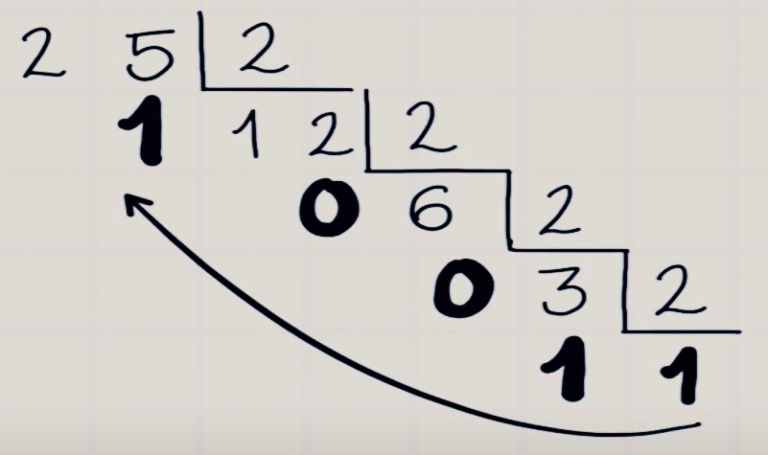

<a href="#Sumario"></a>


<a href="https://github.com/Exemplos-aula-Repticao-FOR/graphs/contributors"></a>
<a href="https://github.com/Exemplos-aula-Repticao-FOR/blob/main/LICENSE"></a>

# Exemplos aula repetição FOR  💻
> Desenvolvido em linguagem Python 🐍
### Por:
- [**Michel**](https://github.com/MichelZero)
- [**Carlos**](https://github.com/SmokeDevL)
- [**Emanuel**](https://github.com/emanuelfranklyn)

<br>

# Sumário 🧮
<details open="open">
    <summary>Exercícios</summary>
    <ol>
        <li>
            <a href="#ex01">Exercício 01 -> 1 a 9.</a>
        </li>
        <li>
            <a href="#ex02">Exercício 02 -> Calculando Fatorial.</a>
        </li>
        <li>
            <a href="#ex03">Exercício 03 -> Manipulando Lista.</a>
        </li>
        <li>
            <a href="#ex04">Exercício 04 -> Conversor pra Binário.</a>
        </li>
    </ol>
</details>

<br>

# ex01
#### <a href="https://github.com/Atividades-de-Algoritmos/Exemplos-aula-Repticao-FOR/blob/main/ex01.py">Ir até o código</a>

<br>

## Sobre 📒:
- Um algoritmo capaz de fazer uma contagem de 1 ao 9.

<br><br>

## Como executar 💽:

No terminal, digite:
```cmd
python ex01.py
```
pressione enter para executar o arquivo.

>A contagem será iniciada no terminal.

<br><br>

## Exemplo no cmd 👨‍💻:
```python
> python ex01.py

1
2
3
4
5
6
7
8
9

fim do programa1
```

<br>

# ex02
#### <a href="https://github.com/Atividades-de-Algoritmos/Exemplos-aula-Repticao-FOR/blob/main/ex02.py">Ir até o código</a>

<br>

## Sobre 📒:
- Um código que solicita do usuário um número inteiro para retornar em tela o valor do fatorial.

- Se o número informado for 5 o código deverá;

`Fatorial -> 5! = 5 x 4 x 3 x 2 x 1`

Acesse o [link](https://www.youtube.com/watch?v=ms2PulxZV3M) para ter uma noção maior sobre fatorial.

<br><br>

## Como executar 👨‍💻:
No terminal, digite:
```cmd
python ex02.py
```
Enter para executar o arquivo .py, e em seguida digite o valor que desejar.

>Será exibido no prompt de comando uma o resultado do fatorial.

<br><br>

## Exemplo no cmd 👨‍💻:
```python
> python ex02.py

Digite um número: 5
O fatorial de 5 é: 120

fim do programa!
```

# ex03
#### <a href = "https://github.com/Atividades-de-Algoritmos/Exemplos-aula-Repticao-FOR/blob/main/ex03.py">Ir até o código</a>

<br>

# Sobre 📒:

- O programa deve ter uma lista inicial com diversos valores, o código deverá eliminar as repetições com um conjunto e mostrar ao usuário a quantidade de repetição de cada elemento.

<br><br>

# Como executar 💽:

No terminal, digite:

```cmd
python ex03.py 
```

Enter para executar o arquivo .py

>Será exibido no cmd a quantidade de ocorrências

<br><br>

# Exemplos no cmd 👨‍💻:

```python
> python ex03.py

Lista: ['a', 'b', 'a', 'a', 'b', 'c', 'd', 'c', 'c', 'a', 'b', 'd', 'd', 'a', 'b']

O item 'c' aparece 3 vezes
O item 'b' aparece 4 vezes
O item 'd' aparece 3 vezes
O item 'a' aparece 5 vezes

fim do programa
```

# ex04

#### <a href = "https://github.com/Atividades-de-Algoritmos/Exemplos-aula-Repticao-FOR/blob/main/ex04.py">Ir até o código</a>

<br>

# Sobre 📒:
- Um código que recebe como entrada um número decimal e converte-o para binário, seguimos a lógica a seguir.

<br>




<br><br>

# Como executar 💽:

No prompt de comando, digite:

```cmd
python ex04.py
```

Pressione enter para executar o arquivo, e informe o número para ser transformado em binário

>O número em binário deve ser exibido no prompt de comando

<br><br>

# Exemplo no cmd 👨‍💻:

```python
Digite um número em decimal: 1342

O número binário é: 10100111110

fim do programa
```

#

Feito com 💚 e ☕ by [**Michel**](https://github.com/MichelZero), [**Carlos**](https://github.com/SmokeDevL) e [**Emanuel**](https://github.com/emanuelfranklyn)

[**IFPB - Campus Cajazeiras**](https://www.ifpb.edu.br)
